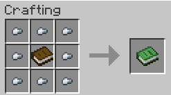
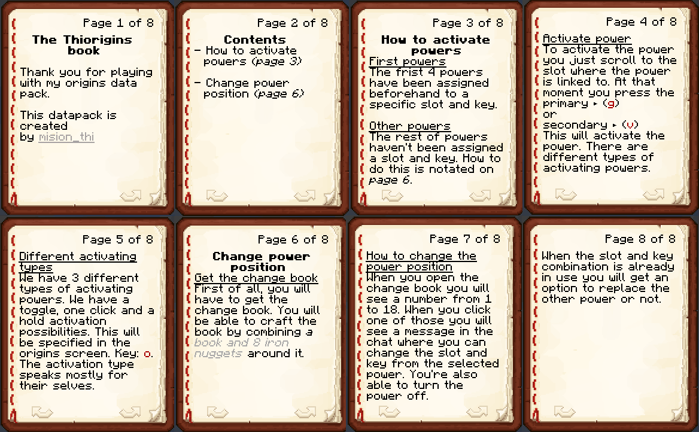

# Thi key library v1 (1.16 only!)
<br />
What it does is it creates the possibility to have more than two active abilities on your origin. 
With this library, you will be able to have up to 18 active powers on one origin. 
The powers will be set on a specific slot and key, for example, slot 0 and primary-key <br />
[**Download**](https://github.com/MisionThi/thi_key_library)

## Contents {: class="b-m"}

* [How do I use it?](#how-do-i-use-it)
* [Activation possibilities](#activation-possibilities)
* [Change the activation location (in-code)](#change-the-activation-location-in-code)
* [Change the activation location (in-game)](#change-the-activation-location-in-game)
* [In-game documentation](#in-game-documentation)


## How do I use it?

**Step 1 - Downloading and placing in folder** <br />
The first step will be downloading the datapack off course. You will be putting the datapack in the following position: 
`.minecraft/saves/<name world>/datapacks/`. <br />
When you have placed it in your datapacks folder make sure the datapack is visible in-game. 
You will be able to check this with the following command: `/datapack list` <br />
If the pack is enabled it will be visible in the first list. <br />

**Step 2 - How you can use it with your pack** <br />
When you go into the data folder from the datapack. You will see three maps in the data folder. <br />
If you want the library in your pack you only have the copy the folder named `thi_key_library`. <br />
And the `key_layer.json` from the `data/origins/origin_layers/`. When you copy those you can use
them in your pack or you could use this datapack next to yours that would also work. <br />

**Step 3 - Custom powers activation type** <br />
You will find all the power files premade with conditions in the folder named `thi_key_example` in the data folder next to the `thi_key_library` folder.
Inside the folder named `powers`, you can find files named power1 through power18. <br >
I would recomend first choosing what activation type you want to have. <br />
See [activation possibilities](#activation-possibilities) for more info on that. <br />

**Step 4 - Add your actions / power-types** <br />
For this there are multiple exaples in the `thi_key_example` folder. <br />
You will be able to change the "type" for the power-types and actions for the action_over_time.<br />
Examples <br/>
power1.json =  action toggle <br/>
power2.json =  action push-hold <br/>
power3.json =  action push <br/>

power4.json =  power-type toggle <br/>
power5.json =  power-type push-hold <br/>
power6.json =  power-type push

## Activation possibilities
In the library, we currently have 3 activation possibilities. We have the **push**, **push-hold** and **toggle**. 
You will have to place the conditions below in the first part from the power file. <br />
primary condition in the part named -> `activation_type_primary` <br />
Secondary condition in the part named -> `activation_type_secondary`

### Push {: class="b-m"}
With the "push" activation you can click the key ones and will the power will activate.
When you hold the key the power will still only activate ones. <br />
How to format the top part examples: `actions = power3.json`, `power-types = power6.json` in the thi_key_example folder <br />
The conditions for it are. <br />

###### Primary {: class="b-m"}
```json
"condition": {
  "type": "origins:resource",
  "resource": "thi_key_library:resources/primary/push_ones",
  "comparison": "==",
  "compare_to": 1
}
```
###### Secondary {: class="b-m"}
```json
"condition": {
  "type": "origins:resource",
  "resource": "thi_key_library:resources/secondary/push_ones",
  "comparison": "==",
  "compare_to": 1
}
```
<br />

### Push-hold 
With the "push-hold" activation you can hold the key and the power will deactivate once you let the key go. <br />
How to format the top part examples: `actions = power2.json`, `power-types = power5.json` in the thi_key_example folder<br />
The conditions for it are. <br />
###### Primary {: class="b-m"}
```json
"condition": {
  "type": "origins:resource",
  "resource": "thi_key_library:resources/primary/push_hold",
  "comparison": "==",
  "compare_to": 1
}
```
###### Secondary {: class="b-m"}
```json
"condition": {
  "type": "origins:resource",
  "resource": "thi_key_library:resources/secondary/push_hold",
  "comparison": "==",
  "compare_to": 1
}
```
<br />

### Toggle 
With the "toggle" activation you press the key ones to activate and ones to deactivate. <br />
How to format the top part examples: `actions = power1.json`, `power-types = power4.json` in the thi_key_example folder<br />
The conditions for it are. <br />
###### Primary {: class="b-m"}
```json
"condition": {
  "type": "origins:resource",
  "resource": "thi_key_library:resources/primary/toggle_convert",
  "comparison": "==",
  "compare_to": 1
}
```

###### Secondary {: class="b-m"}
```json
"condition": {
  "type": "origins:resource",
  "resource": "thi_key_library:resources/secondary/toggle_convert",
  "comparison": "==",
  "compare_to": 1
}
```
<br />

## Change the activation location (in-code)
Important to remember is that only the first four powers are preset to a specific slot and key. <br />
If you want to preset more powers to certain key slot combinations you will have to go to the folder `thi_key_library/powers/resources/power_slot/` 
In this folder, you will find the resources that determine which key slot combination will activate the power.
To change the slot key combination that activates it change the `"start_value": -1,` to the value you want. <br />
See the table below for what value means. <br />

Value | Slot | Key 
------|------|-----
-1 | None | None
0 | 0 | Primary
1 | 1 | Primary
2 | 2 | Primary
3 | 3 | Primary
4 | 4 | Primary
5 | 5 | Primary
6 | 6 | Primary
7 | 7 | Primary
8 | 8 | Primary
9 | 0 | Secondary
10 | 1 | Secondary
11 | 2 | Secondary
12 | 3 | Secondary
13 | 4 | Secondary
14 | 5 | Secondary
15 | 6 | Secondary
16 | 7 | Secondary
17 | 8 | Secondary

<br />

## Change the activation location (in-game)
When you want to change the location from the activation you will first have to craft the change book. You can see the recipie below.
On the first page, you will be able to see the number from 1 through 18. When you click on it. There will be a guide message in your chat.
There you can click on the slot you want to change it to or just turn off it.

Crafting recipie for the the change book: <br />
 

Change book: <br />

<br />

## In-game documentation
You will get this book when you choose your origin.

